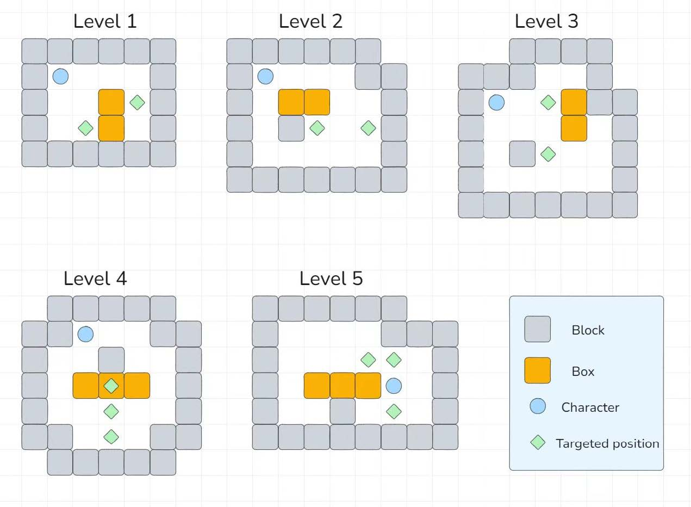

# Sokoban

SUSTech CS109

In this project, you are required to implement a game Sokoban using the Java programming
language.

## I. Game Introduction

Sokoban is a classic puzzle game designed in 1981 by Hiroyuki Imabayashi, and first published in
December 1982. The game challenges players to push boxes onto designated target locations
within a confined space. It emphasizes logical thinking and spatial planning, with the goal of
efficiently maneuvering the boxes to their destinations using the fewest possible moves.

## II. Game Interface & Basic Elements

The game screen consists of a grid-based warehouse layout, where the player controls a
character that can move up, down, left, or right. The grid includes walls, movable boxes, target
locations (often marked), and free spaces. The game starts with some boxes placed on some the
grids, and the player must move them to cover all target locations.

## III. Detailed Game Rules

1. Player Movement:
    * The player can move one tile in any of the four directions: up, down, left, or right.
    * The player cannot pull boxes; boxes can only be pushed.
2. Box Movement:
    * When a player pushes a box, it moves one tile in the direction of the push.
    * A box cannot be moved if there is another box or a wall directly behind it.
    * Multiple boxes cannot be pushed at once; only one box can be pushed per movement.
3. Game Objective:
    * The goal of the game is to push all the boxes onto the target locations.
4. Game Over:
    * The game ends when all the boxes are placed on the target locations, signifying a successful completion.
    * In some circumstances, the game may also feature a "soft fail" scenario where boxes are pushed into some positions
      where they cannot be moved anymore (e.g., into corners), or there is no possibility for box to be pushed to the
      target position.

## IV. Project Requirements

In this project, we will provide 5 basic maps. You must implement these 5 maps as 5 levels of the game. You should
finish the following tasks:

### Task 1: Game Initialization (10 points)

1. [x] After the user logs in or chooses the guest mode, the game will directly enter ~~a level~~ (**a level selection
   interface** is an advanced requirement) and correctly display the map. The game should also display the level number
   and the number of character movement.
2. [x] The game should allow players to restart a new game at any time during gameplay. (Not exiting the program and run
   it again.)
3. [x] When restarting a new game, the game data needs to be consistent with the new game.

### Task 2: Multi-user Login (15 points)

1. [x] Implement a login selection interface for both guests and registered users.
2. [x] Guests can play without registration but do not have the functionality to save game progress.
3. [x] The user login interface includes a registration page and allows login after entering account credentials.
4. [x] After the program exits and is run again, previously registered users can still log in.

### Task 3: Save and Load Games (15 points)

1. [x] Each user (except guests) has the option to load their previous saved game; the save is a single save file, and
   saving again will overwrite the previous save (Overwriting the original save is the basic requirement. Additional
   points would not be given if multiple save slots are implemented per user.)
2. [x] From the game start interface, players can choose to load their last save which should contain information about
   the game board's status and the number of moves made so far.
3. [x] Each user's save data is unique.
4. [x] Manual saving is a basic requirement; implementing **automatic saving** at timed intervals or upon exit can earn
   points in the advanced section.
5. [x] Save File Error Check: If a save file's format or contents are corrupted when loading, the damaged save will not
   be loaded, and the game will still run rather than crash. (If your game is capable of **detecting save files that
   have been modified by others while still maintaining the legitimacy of the save data**，it will earn the advanced
   points.)

### Task 4: Gameplay (30 points)

1. [x] Pushing Boxes: When a player moves the character, they can push any box in the direction they are moving,
   provided there is an empty space behind the box. A box can be moved until it hits a wall or another box.
2. [x] Button control: The interface must include up, down, left, and right buttons to facilitate player movement in
   different directions.
3. [x] Keyboard control: Keyboard control are required for player movement(up, down, left, right)in different
   directions.
4. [x] Game Victory: The goal of the game is to push all the boxes onto the designated target locations. Once all
   targets are covered by boxes, display a victory screen indicating that the puzzle has been successfully solved.
5. [x] Game Fail: If the box cannot be moved (e.g., a box is pushed into a corner) when the game is not victorious,
   either a game-over message or an option to restart the level should be displayed.

### Task 5: Graphical User Interface (GUI) (10 points)

1. [x] Implement a graphical interface for the game using JavaFX, **Swing**, or any other Java graphical framework.
2. You will earn points for this section by completing the code based on the demo provided in the course.
3. Independently creating a GUI will count as Advanced points.
4. If your program need to input into command line，you can not get full points of this task.

### Task 6: Advanced Features (20 points)

Any additional features beyond the basic requirements described above will earn points in this
advanced category, including but not limited to:

1. [x] Enhanced graphics and aesthetics
2. [x] More game modes design
3. [x] level selection interface
4. [ ] Implementation of AI to achieve high scores
5. [x] Adding some animated effects
6. [x] Adding game time display, save time in the archive, introducing a time-limited mode
7. [x] Adding props in the game
8. [x] Adding maps of your own design

* 以JSON的方式读写用户数据和存档
* 检测用户数据和存档的合法性
* 使用SHA加密用户密码（忘记密码了就找不回了（没做忘记密码的功能
* 检测存档SHA值是否匹配以判断是否修改存档（防君子不防小人
* 粒子效果
* 音效
* 游戏计时
* 限时模式
* 最小步数
* 新物品：门、按钮
* 新地图
* 全键盘操控的音乐播放器、存档页面。
* 可以拖动的音乐进度条
* 音乐播放器的音量调节
* 音乐播放器的播放暂停
* 登录、注册检测用户名密码合法性
* 用户可以修改用户名、密码以及删除账户
* 存档页面有存档文件预览
* 通过网络获取随机用户头像，每次登录时随机获取
* 随机更换头像功能
* 撤回功能
* 关卡星级评价
* 关卡选择界面
* 打包exe 可以在无Java环境下运行
* 菜单用户-账号：Box 密码：Revenge - 将hero和box贴图互换。
* 自动存档

## V. Appendix

You must implement followed five maps.

